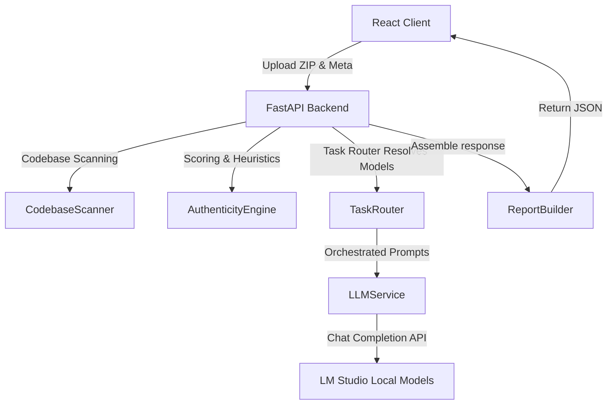

# AI Project Submission Analyzer (AIPSA)

A pixel-perfect diagnostic engine for evaluating developer capabilities and project authenticity based on the Stitch UI/UX design language. AIPSA automates the assessment of zip-based code submissions through structural analysis, rule-based heuristics, and localized LLM evaluations.

---

## 🚀 Key Features

* **Stage 1: Repository Submission (Upload)**
  - Seamless drag-and-drop file uploader for ZIP files.
  - Interactive details input: Project Title, Description, Focus Areas, and custom Claimed Outcomes.
  - Quick-start repository templates for rapid validation (Nexus Core Migration / Neural Network Optimizer).

* **Stage 2: Deep Extraction & Pipeline Analysis**
  - Real-time animated pipeline scanning (extraction, dependency matching, and configuration file checks).
  - Codebase evidence map builder to minimize token footprints for LLM context windows.
  - Live logging feed displaying diagnostics and extraction details.

* **Stage 3: Interactive Viva Examination**
  - Live oral examination simulations with conceptual and codebase-specific questions.
  - Configurable timers per question, expected key point reveals, and grading options (Fail / Partial / Approve).
  - Real-time technical depth telemetry graphs and suspicion tracking markers.

* **Stage 4: Comprehensive Integrity Report**
  - Aggregated performance score combining Viva results (40% weight) and codebase authenticity (60% weight).
  - Multi-category verification grids (Backend, Frontend, Database, Auth, Deployment, testing, etc.).
  - Technical strengths, design review, maintainability score, and security audits.

---

## 🛠️ Architecture & Technologies

AIPSA is structured as a decoupled web application leveraging a high-performance Python API and a reactive single-page dashboard.



### Frontend Stack
* **React 18** — Functional hooks and modular state management.
* **Vite** — Next-generation packaging and high-speed Hot Module Replacement (HMR).
* **Tailwind CSS** — Fluid dark-themed components styled to the Stitch palette.
* **Framer Motion** — Premium micro-interactions and route animations.
* **Recharts** — Dynamic SVG-rendered telemetry gauges and score charts.

### Backend Stack
* **FastAPI** — High-performance ASGI framework with Pydantic schema validation.
* **Uvicorn** — Lightning-fast production server gateway.
* **HTTPX** — Asynchronous client handler for querying OpenAI-compatible local endpoints.

---

## 📁 Project Directory Structure

```
Project-Interviewer/
├── backend/
│   ├── app/
│   │   ├── api/
│   │   │   └── routes.py             # API routers (Analyze & Evaluate endpoints)
│   │   ├── core/
│   │   │   ├── authenticity.py       # Rule-based deterministic heuristics engine
│   │   │   ├── evidence.py           # Code extract & context compressor
│   │   │   ├── extractor.py          # Traversal blocker ZIP safe extractor
│   │   │   └── scanner.py            # Codebase structural scanner
│   │   ├── data/
│   │   │   └── skill_catalog.json    # Pre-defined capabilities list
│   │   ├── models/
│   │   │   ├── project.py            # Project schemas
│   │   │   └── response.py           # Response models
│   │   ├── prompts/
│   │   │   └── *.txt                 # System and user prompt templates
│   │   ├── services/
│   │   │   ├── ai_service.py         # Low-level LM Studio client
│   │   │   ├── llm_service.py        # Task-routed orchestrator
│   │   │   ├── report_builder.py     # Aggregated schema compiler
│   │   │   ├── analysis_service.py   # Pipeline manager coordinator
│   │   │   └── task_router.py        # Model resolver
│   │   ├── config.py                 # Environment configurations
│   │   └── main.py                   # FastAPI application root
│   ├── verify_backend.py             # Asynchronous programmatic test suite
│   ├── requirements.txt              # Backend dependencies list
│   └── .env                          # Local backend environment file
├── src/
│   ├── components/                   # Modular UI components
│   ├── contexts/                     # Project state context engine
│   ├── pages/                        # Main dashboard views (Stage 1 to 4)
│   └── App.jsx                       # Main client setup
├── package.json                      # Frontend configuration manifest
└── vite.config.js                    # Vite server configurations
```

---

## ⚙️ Setup & Configuration

### Prerequisites
- Node.js (v18+)
- Python (3.9+)
- **LM Studio** (configured to serve local models on port `1234`)

### 1. Model Configuration
Ensure you have loaded the following models in LM Studio and started the server:
* **Phi-3** (`phi-3-mini-4k-instruct`)
* **Gemma-3** (`google/gemma-3-4b`)

### 2. Backend Setup
1. Navigate to the backend directory and install dependencies:
   ```bash
   cd backend
   pip install -r requirements.txt
   ```
2. Configure `.env` file (copied from `.env.example`):
   ```ini
   HOST=127.0.0.1
   PORT=8000
   LM_STUDIO_BASE_URL=http://127.0.0.1:1234/v1
   PHI_MODEL=phi-3-mini-4k-instruct
   GEMMA_MODEL=google/gemma-3-4b
   CONCURRENT_LLM_INFERENCE=False
   ```
3. Start the FastAPI backend:
   ```bash
   python -m uvicorn app.main:app --host 127.0.0.1 --port 8000 --reload
   ```

### 3. Frontend Setup
1. Navigate to the root directory and install node dependencies:
   ```bash
   cd ..
   npm install
   ```
2. Run the Vite development server:
   ```bash
   npm run dev
   ```
3. Open `http://localhost:3000` in your web browser.

---

## 📡 API Endpoints

### 1. Analyze Submission
* **Route**: `POST /api/analyze-submission`
* **Format**: `multipart/form-data`
* **Parameters**:
  - `title` (text) — Project title.
  - `description` (text) — Project summary.
  - `outcomes` (JSON array string) — Claims to verify.
  - `questionsCount` (integer) — Number of viva questions.
  - `focusAreas` (JSON array string) — Domains of assessment.
  - `file` (binary ZIP) — Codebase archive.

### 2. Evaluate Answer
* **Route**: `POST /api/evaluate-answer`
* **Format**: `application/json`
* **Payload**:
  ```json
  {
    "question": "...",
    "expectedPoints": ["..."],
    "candidateAnswer": "..."
  }
  ```

---

## 🧪 Verification
You can programmatically verify all backend services and validation routines by executing:
```bash
cd backend
python verify_backend.py
```
This tests the health checkpoints, performs a full submission analysis flow with mock ZIP file creation, and validates answer grading parameters.
