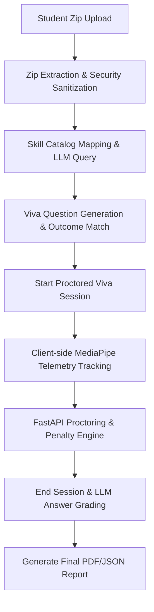

# How AIvaluate Works: Architectural & Technical Overview

This document provides a detailed technical overview of how the **AIvaluate** system is designed, how its core pipelines process data, and how the frontend telemetry, backend scoring engine, and LLM integrations interact.

---

## 1. System Architecture Overview

AIvaluate is built using a modern decoupled architecture:
1. **Frontend (Vite + React)**: A responsive single-page web application styled with vanilla CSS. It handles user authentication, codebase uploads, webcam capture, local proctoring using MediaPipe, and real-time dashboard updates.
2. **Backend (FastAPI)**: A Python-based asynchronous ASGI web framework that manages database transactions, handles telemetry events, coordinates with LLM APIs, and enforces Role-Based Access Control (RBAC).
3. **Database (SQLite + SQLAlchemy Async)**: An asynchronous SQLite engine managed via SQLAlchemy ORM. It stores persistent models including Users, Submissions, Evaluation Reports, Viva Sessions, and Proctoring Events.

---

## 2. Core Workflows & Pipelines



### Pipeline A: Submission Analysis & Question Generation
When a student uploads a project ZIP archive, the following sequence occurs:
1. **Safety Verification**: The ZIP file is uploaded to `backend/app/data/uploads` and parsed by `extractor.py`. A strict safety sanitization pass checks for zip bombs and path traversal attempts (e.g. `../../malicious.py`). If unsafe files are detected, a `ZipSafetyError` is raised, and the request is rejected.
2. **Feature Extraction**: The system extracts the project files structure (file tree), dependency configuration (e.g. `requirements.txt`, `package.json`), and reads code snippets from files containing logic.
3. **LLM Analysis (Gemini Integration)**: The codebase profile is sent to the Gemini API (`gemini-2.5-flash`) along with the project outcomes stated by the student and the predefined skill catalog.
4. **Skill Mapping & Question Generation**:
   * Gemini maps the evidence in the code to the catalog's skills.
   * For each mapped skill, it generates two viva questions: one **conceptual** question and one **codebase-specific** question referencing a real file in the student's submission.
   * It matches code evidence against student-stated outcomes to verify if the outcomes are met, partial, or not met.
5. **Persistence**: The submission and generated questions are saved, and a sanitized summary (without the questions' grading/answer rubrics) is sent to the student.

---

### Pipeline B: Viva Session Lifecycle & Proctoring Telemetry
The proctoring system ensures the integrity of the viva session through a client-server event pipeline:
1. **Consent and Setup**: The student must explicitly acknowledge consent. The `/viva-session/start` endpoint checks this server-side, creating a `VivaSession` row in the database and logging an `interview_started` event.
2. **Identity Verification Gate**: The session starts in a `pending` state. The student must verify their camera, which fires an `id_verified` event. The backend enforces that no questioning telemetry can be logged until the identity state is resolved.
3. **Local Webcam Tracking**: During active questioning, the frontend uses the user's webcam and the **MediaPipe FaceMesh** library to track facial features.
4. **Event Detection**: The client-side telemetry trackers identify anomalies:
   * **Gaze Tracking**: If the student's face turns away from the screen for longer than `GAZE_OFF_SCREEN_THRESHOLD_SEC`, a `gaze_off_screen` event is dispatched.
   * **Presence Check**: If the student's face leaves the frame completely for longer than `FACE_NOT_DETECTED_THRESHOLD_SEC`, a `face_not_detected` event is dispatched.
   * **Window Focus**: If the student switches browser tabs or exits fullscreen mode, the frontend intercepts the event and posts `tab_switched` or `fullscreen_exited` immediately.
   * **Activity Trackers**: Telemetry captures voice activity (`speaking_detected`), user inactivity timeouts (`user_inactive`), and clipboard actions (`paste_attempted`).

---

### Pipeline C: Real-Time Proctoring & Penalty Engine
1. **Telemetry Logging**: Telemetry events are posted to `/viva-session/event` and processed by the `proctoring_engine.py`.
2. **Score Computation**: The engine maintains a real-time integrity score (starting at `1.0` or `100%`) and applies configurable deductions for flags:
   * Tab switches deduct `-0.1`
   * Off-screen gazes deduct `-0.05`
   * Multiple faces detected deduct `-0.2`
   * Exiting fullscreen mode deduct `-0.15`
   * Complete connection loss (no telemetry events for longer than timeout) triggers a `-0.3` deduction.
3. **Risk Bucketing**: Based on the integrity score, the system computes the risk level:
   * **Low Risk**: Integrity Score $\ge 80\%$
   * **Medium Risk**: $50\% \le$ Integrity Score $< 80\%$
   * **High Risk**: Integrity Score $< 50\%$ (or if identity verification failed)

---

### Pipeline D: Session Finalization & Evaluation
1. **Ending the Viva**: When the student finishes the viva, the frontend calls `/viva-session/end` submitting their transcribed or typed answers.
2. **Automatic Grading**: The backend routes these answers to the Gemini API (`grade_viva_answers`). Gemini acts as a strict academic examiner:
   * It evaluates each answer on a scale from `0` to `10`.
   * It provides qualitative feedback and highlights the correct core concepts.
   * It computes an overall viva score and a narrative summary.
3. **Database Write**: The backend computes final proctoring summaries, updates the session status to `completed`, and persists the evaluations.
4. **Minimal Student Ack**: The endpoint returns a minimal success message `{"status": "viva_completed", "session_id": ...}` to prevent leaking proctoring scores or grading rubrics.
5. **Mentor Report & SSE Streams**: Mentors can view real-time proctoring streams via Server-Sent Events (SSE) `/mentor/viva-session/{session_id}/stream` and fetch completed final evaluation packages. Mentors can also export reports as comprehensive PDFs.

---

## 3. Database Schema Overview

The SQLite database contains 5 core tables defining entities and relationships:

```
+-------------+         +-----------------+         +---------------------+
|    users    |         |   submissions   |         | evaluation_reports  |
+-------------+         +-----------------+         +---------------------+
| id (PK)     |<------->| id (PK)         |<------->| id (PK)             |
| email       |         | student_id (FK) |         | submission_id (FK)  |
| password    |         | project_title   |         | suggested_skills    |
| role        |         | description     |         | evaluation_report   |
| name        |         | outcomes        |         +---------------------+
+-------------+         | zip_path        |
       ^                +-----------------+
       |                         ^
       |                         |
       |                         v
+-----------------------------------------+         +---------------------+
|              viva_sessions              |<------->|     viva_events     |
+-----------------------------------------+         +---------------------+
| id (PK/FK to submission)                |         | id (PK)             |
| submission_id (FK)                      |         | session_id (FK)     |
| mentor_id (FK to users)                 |         | event_type          |
| status ("pending", "completed", etc.)   |         | timestamp           |
| id_check ("pending", "verified", etc.)  |         | duration_ms         |
| integrity_score                         |         | confidence          |
| risk_level                              |         | severity            |
| started_at / ended_at                   |         +---------------------+
| flags / proctoring_report               |
| viva_grading                            |
+-----------------------------------------+
```

---

## 4. Security & RBAC Enforcement

The system maintains strict Role-Based Access Control (RBAC) boundaries:
* **Student Access**: 
  * Permitted to call: `/analyze-submission`, `/viva-session/start`, `/viva-session/event`, `/viva-session/end`.
  * Gated from seeing: detailed proctoring flags, integrity scores, risk levels, and viva grading details.
* **Mentor Access**:
  * Permitted to call: `/mentor/sessions`, `/mentor/sessions/{session_id}`, `/mentor/sessions/{session_id}/stream`, `/reports/{session_id}/export`.
  * Has full read access to all telemetry events, live flag status streams, code evaluation outputs, grading scores, and PDF exports.
