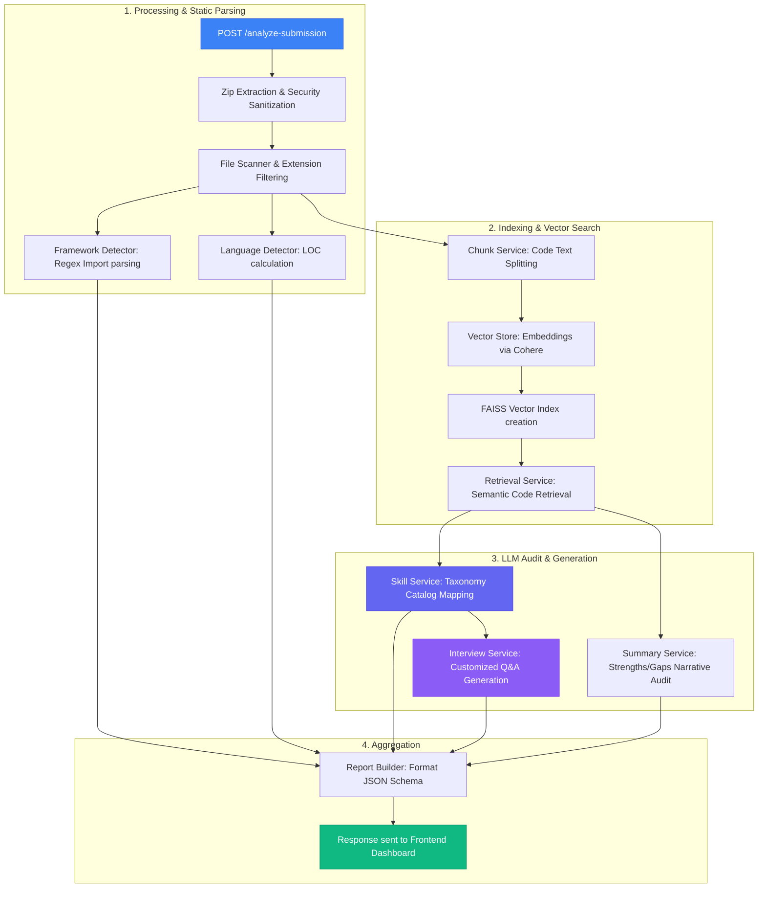

# Project Analyzer Backend API

A modular Flask-based API that evaluates student software engineering projects. It accepts a ZIP archive of the source code, scans and parses files, detects programming languages and framework structures, runs semantic searches over codebase embeddings, and queries Gemini to generate detailed feedback, conceptual/practical interview questions, and alignment reports against target outcomes.

---

## Getting Started

### 1. Prerequisites
- Python 3.10+
- A Google Gemini API Key

### 2. Installation & Setup

1. Navigate to the backend directory:
   ```bash
   cd backend
   ```
2. Create and activate a virtual environment:
   ```bash
   python -m venv venv
   # On macOS/Linux:
   source venv/bin/activate
   # On Windows:
   venv\Scripts\activate
   ```
3. Install dependencies:
   ```bash
   pip install -r requirements.txt
   ```
4. Create a `.env` file in the `backend/` directory:
   ```env
   GOOGLE_API_KEY="your-gemini-api-key-here"
   ```

### 3. Running the Server

Start the Flask application:
```bash
python -m app.main
```
The server will start on `http://127.0.0.1:5000`.

---

## API Endpoints

### 1. Health Check
Checks if the backend API is up and running.

- **URL**: `/health`
- **Method**: `GET`
- **Response Format**: `JSON`

#### Example `curl` Command:
```bash
curl -X GET "http://127.0.0.1:5000/health"
```

#### Example Response:
```json
{
  "message": "project analyzer api is running",
  "status": "ok"
}
```

---

### 2. Analyze Submission
Accepts a ZIP file containing the project source code, parses the structural components, scans frameworks/languages, and returns an extensive AI analysis, suggested skills, custom interview questions, and project summary evaluation.

- **URL**: `/analyze-submission`
- **Method**: `POST`
- **Content-Type**: `multipart/form-data`

#### Parameters:
| Parameter Name | Type | Required | Description |
| :--- | :--- | :--- | :--- |
| `zip_file` | File (`.zip`) | **Yes** | The project files zipped together. |
| `project_title` | String (Form Field) | No | The title of the project to check against. |
| `project_description` | String (Form Field) | No | Brief overview or expectations of the project. |
| `project_outcomes` | String/JSON Array (Form Field) | No | Expectations to assess (either string list like `["API Design", "Docker"]` or comma-separated: `API Design, Docker`). |
| `questions_per_skill` | Integer (Form Field) | No | Number of interview questions to generate per detected skill (default is `5`). |

#### Example `curl` Command:
```bash
curl -X POST "http://127.0.0.1:5000/analyze-submission" \
  -F "project_title=Bunzo Application" \
  -F "project_description=A Python Flask REST API with authentication and SQLite." \
  -F 'project_outcomes=["Build REST API","Implement JWT Authentication","Use SQLite Database"]' \
  -F "questions_per_skill=2" \
  -F "zip_file=@/path/to/your/project-archive.zip"
```

#### Example Response:
```json
{
  "overall_score": 85.0,
  "suggested_skills": [
    {
      "skill_name": "Flask",
      "confidence": 0.95,
      "rationale": "Detected Flask app registration in app.py"
    },
    {
      "skill_name": "JWT Authentication",
      "confidence": 0.9,
      "rationale": "Usage of PyJWT tokens for protecting endpoints in auth.py"
    }
  ],
  "language_analysis": [
    {
      "language": "Python",
      "loc": 450,
      "percentage": 100.0
    }
  ],
  "framework_analysis": [
    {
      "framework": "Flask",
      "confidence": 0.95,
      "evidence": [
        "Found 'flask' in requirements.txt",
        "Found import 'Flask' in code"
      ]
    }
  ],
  "evaluation_report": {
    "skills": [
      {
        "skill_name": "Flask",
        "questions": [
          {
            "question_text": "Why did you choose Flask over alternative frameworks like FastAPI?",
            "expected_answer": "Flask is lightweight, modular, and offers great flexibility for building single-module REST APIs.",
            "topic": "Flask Framework",
            "difficulty": "Easy"
          }
        ]
      }
    ],
    "strengths": [
      "Modular routing design",
      "Good token security handling"
    ],
    "gaps": [
      "No unit tests detected"
    ],
    "summary": {
      "narrative": "The submission represents a clean implementation of a Flask REST API with JWT authorization.",
      "strengths": [
        "Modular routing design"
      ],
      "gaps": [
        "No unit tests detected"
      ],
      "alignment_score": 85.0
    }
  },
  "metadata": {
    "files_analyzed": 5,
    "total_chunks": 12,
    "total_files": 5
  }
}
```

---

## 🏗️ Execution Pipeline & Architecture

The backend operates as a structured evaluation pipeline using static analysis and LLM semantic auditing:



### Core Architecture & Modules:

1. **Request Entry & Verification** ([analyze.py](file:///home/bart-simpson/Code/INTERN/backend/app/api/routes/analyze.py)): Coordinates request inputs, temporary working directories, service invocations, final payload construction, and directory cleanup.
2. **Safe ZIP Processing** ([zip_service.py](file:///home/bart-simpson/Code/INTERN/backend/app/services/zip_service.py)): Prevents **Zip Slip vulnerability** by verifying targets reside strictly within the temporary directory boundaries.
3. **Static Syntax Analysis**:
   - **Language Detector** ([language_detector.py](file:///home/bart-simpson/Code/INTERN/backend/app/services/language_detector.py)): Excludes configuration formats and counts Lines of Code (LOC) for code files.
   - **Framework Detector** ([framework_detector.py](file:///home/bart-simpson/Code/INTERN/backend/app/services/framework_detector.py)): Parses imports and dependencies using custom regex lists.
   - **Language Parser** ([parser_service.py](file:///home/bart-simpson/Code/INTERN/backend/app/services/parser_service.py)): Extracts definitions of classes, functions, and API endpoints.
4. **Vector Embeddings & Semantic Search**:
   - **Chunk Service** ([chunk_service.py](file:///home/bart-simpson/Code/INTERN/backend/app/services/chunk_service.py)): Overlaps file structures for LLM readiness.
   - **FAISS Vector Store** ([vector_store.py](file:///home/bart-simpson/Code/INTERN/backend/app/services/vector_store.py)): Computes semantic representations via Cohere and manages rate-limits with backoff logic.
   - **Retrieval Service** ([retrieval_service.py](file:///home/bart-simpson/Code/INTERN/backend/app/services/retrieval_service.py)): Queries context chunks mapping to general architectural attributes.
5. **LLM Orchestrators (Gemini API)**:
   - **Taxonomy Skill Mounter** ([skill_service.py](file:///home/bart-simpson/Code/INTERN/backend/app/services/skill_service.py)): Maps files back to [skill_catalog.json](file:///home/bart-simpson/Code/INTERN/backend/app/models/skill_catalog.json). Leverages dynamic fallbacks to programming languages (e.g., Rust, Go) if no database/framework matches.
   - **Custom Interview Generator** ([interview_service.py](file:///home/bart-simpson/Code/INTERN/backend/app/services/interview_service.py)): Builds codebase-specific and conceptual interview checks.
   - **Executive Auditor** ([summary_service.py](file:///home/bart-simpson/Code/INTERN/backend/app/services/summary_service.py)): Audits structure strengths and development gaps.

